# JETS User Workflow

JETS should feel like one continuous hardware solution workflow, not a set of
loosely connected pages.

## Primary Journey

```mermaid
flowchart LR
  Home["Home: what are you trying to build?"]
  Goal["Goal-first project wizard"]
  Project["Create project"]
  Builder["Builder home"]
  Inventory["Contextual inventory picker"]
  Validate["Continuous validation"]
  Knowledge["Platform knowledge"]
  Intelligence["Solution intelligence"]
  Optimize["Optimize build"]
  Branch["Branch scenario"]
  Compare["Compare alternatives"]
  Finish["Finished solution"]

  Home --> Goal
  Goal --> Project
  Project --> Builder
  Builder --> Inventory
  Inventory --> Builder
  Builder --> Validate
  Validate --> Knowledge
  Knowledge --> Intelligence
  Intelligence --> Optimize
  Optimize --> Branch
  Branch --> Compare
  Compare --> Finish
  Optimize --> Finish
```

## Product Rule

Users should rarely think, "I am going to Inventory."

Inventory should feel like a file picker that appears when a builder slot needs
hardware:

- Choose a GPU.
- Choose a PSU.
- Choose RAM.
- Choose a base system.
- Choose an adapter path.

The standalone `/inventory` route still exists for beta testing and research,
but the normal flow starts from a project slot.

## Project Creation

Project creation begins with a goal:

- Gaming PC
- AI workstation
- CAD / Engineering workstation
- Home server
- Office PC
- Upgrade existing computer
- Custom project

Each goal sets:

- project title
- use case
- budget default
- preference preset
- owned-hardware assumptions where useful
- first suggested slot
- optimization direction
- project note explaining what JETS will optimize for

## Builder Stages

The project builder uses one progress spine:

1. Project
2. Components
3. Validate
4. Platform Knowledge
5. Solution Intelligence
6. Optimize
7. Compare
8. Finish

Stages unlock naturally:

- Components begin when at least one slot is filled.
- Validate becomes meaningful once required slots are filled.
- Platform Knowledge becomes meaningful when a known base system, chassis, or
  motherboard is selected.
- Solution Intelligence becomes useful as soon as multiple core components can
  be reasoned about together.
- Optimize becomes meaningful after the build has enough hardware context.
- Compare becomes useful after branches or alternatives exist.
- Finish requires required slots, validation review, and at least one optimization pass.

## Navigation Principles

Primary navigation should stay focused:

- Home
- Projects
- Builder
- Inventory
- Account

Supporting pages remain available but should not compete with the main journey:

- Snapshots
- Activity
- Compatibility
- Sources
- Roadmap
- Demo and setup pages

## Empty-State Rule

Every empty state should answer the next action:

- No projects yet: create a project.
- No components yet: add the first missing slot.
- No optimization runs yet: optimize this build.
- No solution reasoning yet: add core components so JETS can explain the build.
- No branches yet: try another scenario.
- No activity yet: add a component or note.
- No saved research yet: open the builder or contextual inventory.

## Current Boundary

JETS currently uses mock/demo inventory only.

No AI, live scraping, marketplace APIs, checkout, or enterprise features are
active in this workflow.
